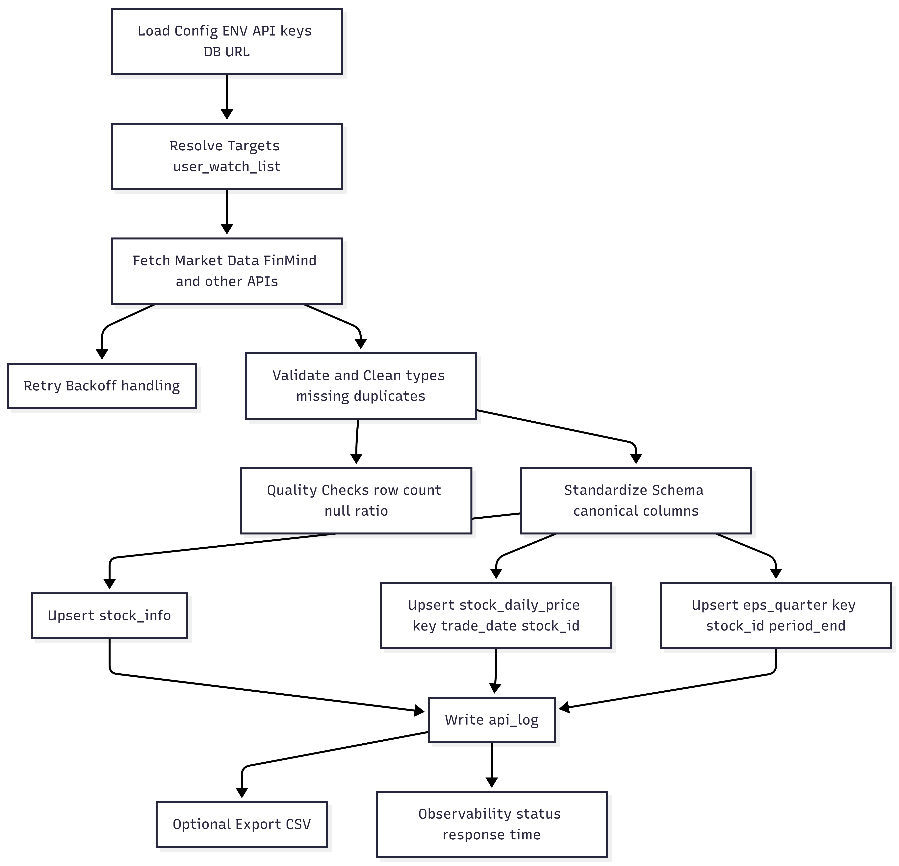

# Stock Data Pipeline for Personalized Investment Analysis

> 📘 Traditional Chinese version: [README-zh-TW.md](README-zh-TW.md)

---

## Overview

Although market data is widely accessible, **personalized investment analysis remains largely manual** due to differences in purchase cost, entry timing, and individual stock selection.

Most existing platforms emphasize market-wide indicators or price prediction. However, practical investment metrics such as returns and dividend yield are inherently **user-dependent**, relying on factors including:

- Purchase price  
- Holding period  
- Personalized stock composition (watchlist)

As a result, many individual investors still rely on Excel-based workflows that are time-consuming and error-prone.

This project provides a **data pipeline–centric solution**.  
The Minimum Viable Product (MVP) enables users to retrieve daily Taiwan stock market data based on their personal watchlists and export **clean, analysis-ready CSV files** for Excel, SQL, or BI tools.

Rather than focusing on price prediction, this project emphasizes **decision support through structured data and contextual analysis**.

---

## Problem & Goals

### Problems
- Manual daily price updates are inefficient and inconsistent  
- Personalized investment metrics are difficult to maintain across heterogeneous portfolios  

### Goals
- Replace manual Excel workflows with a reproducible data pipeline  
- Support watchlist-based, user-level data retrieval  
- Provide stable CSV outputs for downstream analysis  

---

## Key Features

- User-defined stock watchlists stored in a relational database  
- Batch retrieval of daily market data via external financial APIs  
- Standardized CSV export with a stable analytical schema  
- Metadata for traceability (data source, fetch timestamp)  

---

## Project Status

### Completed
-  Watchlist-driven data ingestion pipeline  
-  Daily stock price retrieval via external financial APIs  
-  Standardized, analysis-ready CSV export (`excel_update` schema)  
-  Relational database schema with explicit analytical data grains  
-  ER diagram and end-to-end pipeline design documentation  

### In Progress
-  Pipeline observability and execution metrics (coverage, freshness)  
-  API logging and execution tracking (`api_log`)  
-  Incremental data refresh and scheduling support  

### Planned
-  User-level performance metrics (returns, yield)  
-  Financial fundamentals enrichment (EPS, dividends)  
-  News integration and semantic analysis for contextual insights  

---

## Data Source & Output Schema

### Data Source
- **FinMind API**: Daily prices and trading volume

### Output CSV Schema (`excel_update`)

The natural analytical primary key is **(trade_date, stock_id)**.

| Column     | Description                |
|------------|----------------------------|
| trade_date | Trading date               |
| stock_id   | Stock identifier           |
| close      | Closing price              |
| volume     | Trading volume             |
| source     | Data source                |
| fetched_at | Data fetch timestamp (UTC) |

---

## System Design

### ER Diagram

The ER diagram illustrates analytical join paths across users, watchlists, stock metadata, and daily price records, with explicit data grain definitions and stable primary/foreign keys.


### Data Pipeline Flow

The pipeline is designed to be reproducible and analysis-oriented.

1. Load configuration from environment variables  
2. Resolve user watchlists from the database  
3. Fetch daily stock data from external APIs  
4. Validate, clean, and standardize the schema  
5. Export CSV files for downstream analysis  



---

## Technology Stack

### Data & Backend
- **Language**: Python 3  
- **Database**: PostgreSQL  
- **External APIs**: FinMind (Taiwan stock market data)

### Data Processing
- Batch-oriented data ingestion  
- Idempotent upserts based on natural composite keys  
- Schema standardization for downstream analytics  

### Tooling
- Docker (local PostgreSQL setup)  
- Environment-based configuration via `.env`  
- Git for version control  

---

## Getting Started

### Prerequisites
- Python 3.10+ 
- PostgreSQL (Docker-supported)  
- Environment variables configured via `.env`

### Run via CLI

```bash
python -m data_pipeline.cli \
  --email seed_user@example.com \
  --start 2025-01-01 \
  --end 2025-01-10 \
  --schema excel_update \
  --out out/excel_update.csv
```

This command retrieves daily stock data based on the user's watchlist and exports a standardized CSV file for analysis.

---

## Data Quality & Validation

- Uniqueness constraint on `(trade_date, stock_id)`
- Non-negative constraints for price and volume
- Proper handling of non-trading days (weekends and market holidays)

### Sample SQL

```sql
SELECT w.stock_id
FROM user_watch_list w
JOIN user_users u ON u.id = w.user_id
WHERE u.email = 'seed_user@example.com';
```

---

## Roadmap

-  Scheduled daily refresh
-  User-level performance metrics
-  Integration of financial news and semantic analysis

---

## Team

This project is developed collaboratively with clear ownership across system components.

**Frontend Development / UI–UX Design**: Zhuowen Chen  
GitHub: [@Zhuowen-Chen](https://github.com/Zhuowen-Chen)

**Backend Development / Data Pipeline Design**: Chiayu Lin, Zhuowen Chen  
GitHub: [@chiayu-lin29](https://github.com/chiayu-lin29), [@Zhuowen-Chen](https://github.com/Zhuowen-Chen)

---


## Contact

chiayulin22@gmail.com
zhuowenchen1993@gmail.com
